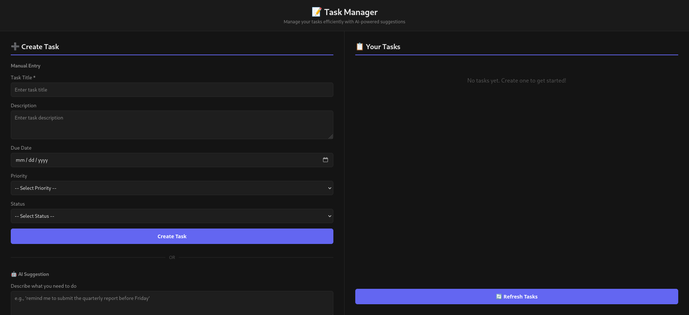

# Task Manager API with AI Suggestions

A Spring Boot REST API for personal task management with AI-powered task suggestions using Ollama Mistral. Built with Java 17, Spring Boot, H2 database, and a responsive web UI.



## Table of Contents

- [Tech Stack](#tech-stack)
- [Features](#features)
- [Prerequisites](#prerequisites)
- [Quick Start](#quick-start)
  - [1. Install Ollama and Mistral](#1-install-ollama-and-download-mistral-model-for-ai-suggestions)
  - [2. Run the Application](#2-run-the-application)
- [API Endpoints](#api-endpoints)
  - [Task Management](#task-management)
  - [AI-Powered Task Suggestions](#ai-powered-task-suggestions)
- [Configuration](#configuration)
- [Development](#development)
- [Troubleshooting](#troubleshooting)

<br>

## Tech Stack

- **Java 17** - Language
- **Spring Boot 3.3.0** - Framework
- **Spring Data JPA** - Database access
- **H2 Database** - In-memory database
- **Gradle 7+** - Build tool
- **JUnit 5** - Testing framework
- **Mockito** - Mocking library
- **Lombok** - Boilerplate reduction
- **Ollama Mistral** - AI integration
- **Vanilla JavaScript** - Frontend

## Features

- **CRUD Operations**: Create, read, update, delete tasks
- **Task Filtering**: Filter by status, priority, date range, or search by title
- **AI Suggestions**: Generate task suggestions from natural language using Ollama Mistral
- **Web UI**: Responsive single-page application for task management
- **Comprehensive Tests**: 26 unit and integration tests
- **No External Dependencies**: H2 in-memory database, local Ollama (no API keys needed)

## Prerequisites

### Required
- Java 17+
- Gradle 7.0+ (gradlew wrapper included)

### Optional
- Ollama Mistral (for AI suggestions) - [Download Ollama](https://ollama.ai)
  - You need a minimum 4GB of RAM available for running the Mistral model.

## Quick Start

### 1. Install Ollama and Download Mistral Model (for AI suggestions)

Download and install Ollama from https://ollama.ai if you have not already.

```bash
# Start Ollama 
ollama serve

# Then download the Mistral model:
ollama pull mistral
```

Ollama will listen on `http://localhost:11434` by default.

### 2. Run the Application

```bash
# From the task-manager-api directory
sh gradlew bootRun
```

The API will start on http://localhost:8080 once you see the console message, "`Tomcat started on port 8080 (http) with context path '/'`". Even if it is not at 100% executing.


**Note:** The AI generates a task object but does NOT automatically save it. You can review it and then create it with the POST /tasks endpoint by clicking Create Task on the UI.

## API Endpoints

### Task Management

#### Create Task
```bash
POST /tasks
Content-Type: application/json

{
  "title": "Buy groceries",
  "description": "Milk, eggs, bread",
  "dueDate": "2024-01-15",
  "priority": "HIGH",
  "status": "TODO"
}
```

**Response:** `201 Created`
```json
{
  "id": 1,
  "title": "Buy groceries",
  "description": "Milk, eggs, bread",
  "dueDate": "2024-01-15",
  "priority": "HIGH",
  "status": "TODO",
  "createdAt": "2024-01-10"
}
```

#### Get All Tasks
```bash
GET /tasks
```

**Response:** `200 OK` - Array of all tasks

#### Get Task by ID
```bash
GET /tasks/{id}
```

**Response:** `200 OK` or `404 Not Found`

#### Update Task
```bash
PUT /tasks/{id}
Content-Type: application/json

{
  "title": "Buy groceries",
  "status": "DONE",
  "priority": "MEDIUM"
}
```

**Response:** `200 OK` - Updated task or `404 Not Found`

#### Delete Task
```bash
DELETE /tasks/{id}
```

**Response:** `204 No Content` or `404 Not Found`

### AI-Powered Task Suggestions

#### Generate Task from Description
```bash
POST /tasks/suggest
Content-Type: application/json

{
  "description": "I need to finish the project report by next Friday with charts and analysis"
}
```

**Response:** `200 OK`
```json
{
  "title": "Finish project report",
  "description": "Create charts and analysis for project report",
  "dueDate": "2024-01-19",
  "priority": "HIGH",
  "status": "TODO"
}
```


## Configuration

### application.properties

Key configuration options:

```properties
# Server
server.port=8080

# Database
spring.datasource.url=jdbc:h2:mem:taskdb
spring.datasource.driver-class-name=org.h2.Driver
spring.datasource.username=sa
spring.datasource.password=

# Ollama AI
ollama.base-url=http://localhost:11434
ollama.model=mistral

# Logging
logging.level.root=INFO
logging.level.com.taskmanager=DEBUG
```

### Custom Ollama Configuration

To use a different Ollama instance or model, modify `application.properties`:

```properties
# Use remote Ollama server
ollama.base-url=http://192.168.1.100:11434

# Use different model (e.g., llama2 instead of mistral)
ollama.model=llama2
```

## Development

### Build Project
```bash
sh gradlew clean build
```

### Run Tests
```bash
sh gradlew test
```

### Build Docker Image (if needed)
```bash
sh gradlew bootBuildImage
```

### Check Dependencies
```bash
sh gradlew dependencies
```

## Troubleshooting

### Application fails to start
- Ensure Java 17 is installed: `java -version`
- Check if port 8080 is available: `lsof -i :8080`
- Start application with verbose logging:
  ```bash
  sh gradlew bootRun --info
  ```

### Ollama connection errors
- Verify Ollama is running: `ollama serve` (or check if running as service)
- Verify Mistral model is downloaded: `ollama list`
- Test Ollama directly: `curl http://localhost:11434/api/tags`
- If Ollama unavailable, AI suggestions will not be done

### Tests fail
- Ensure H2 database driver is included: `sh gradlew dependencies | grep h2`
- Run tests with verbose output: `sh gradlew test --info`
- Clean and rebuild: `sh gradlew clean build`

